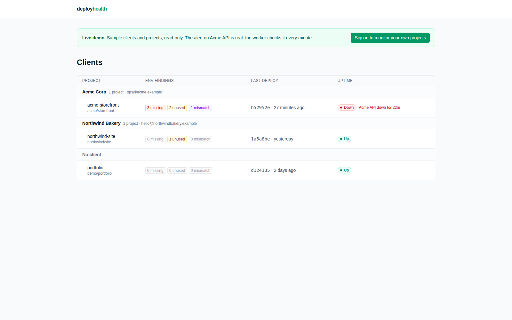
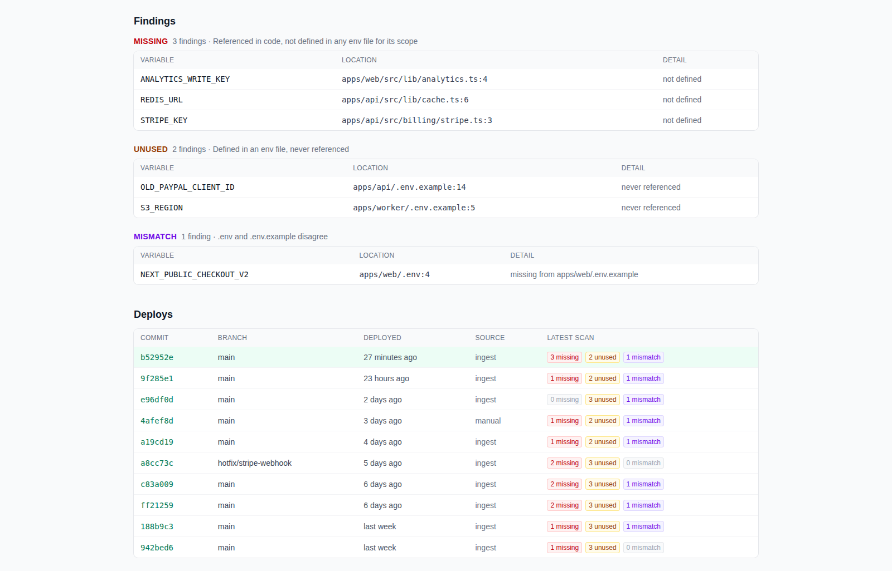
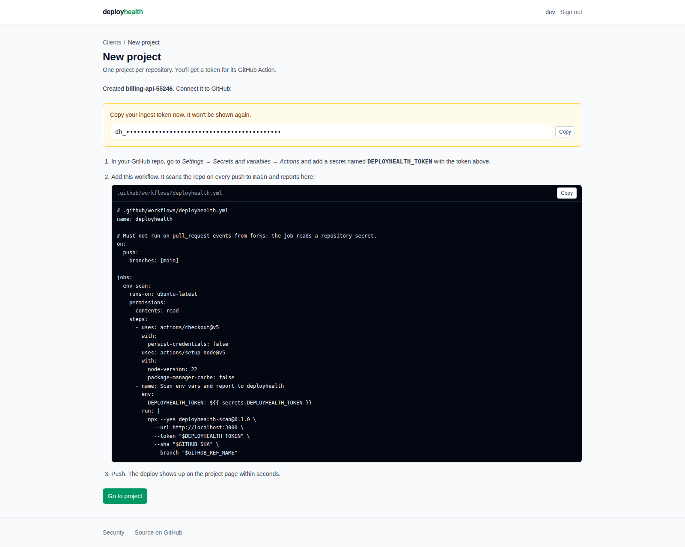
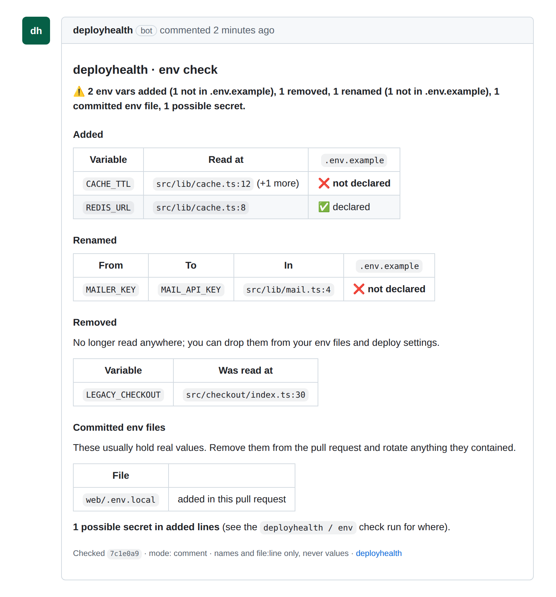
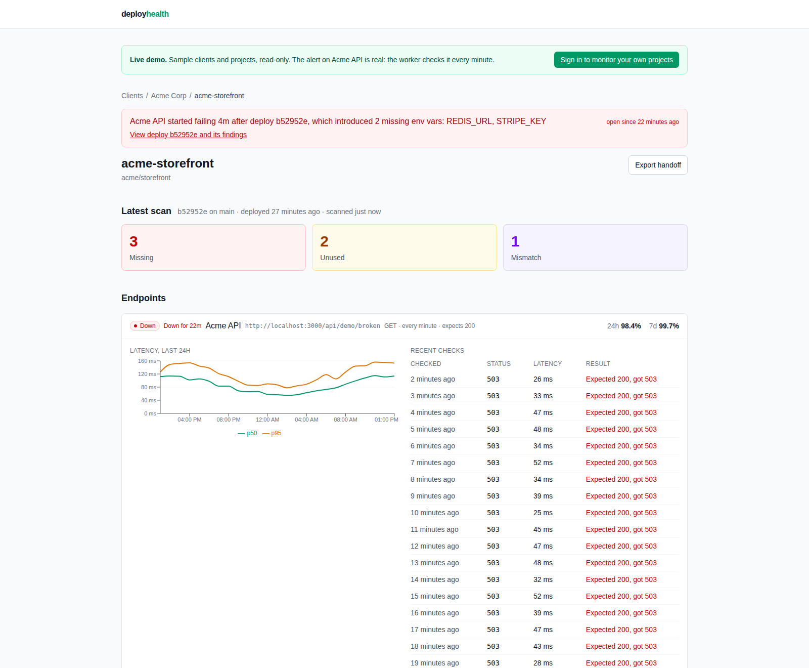
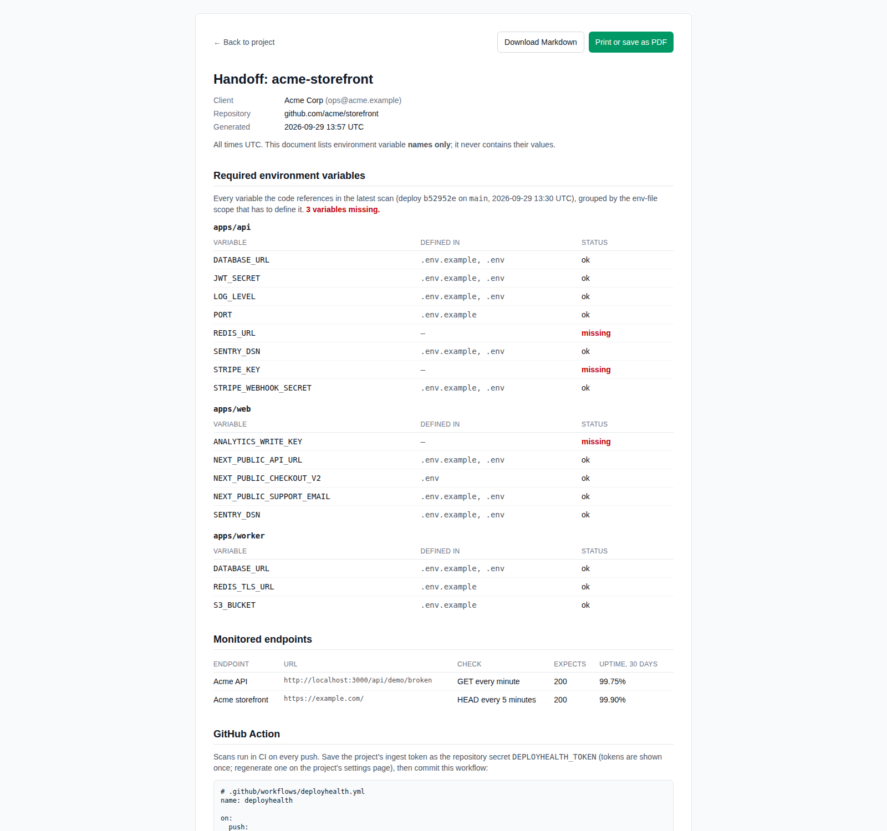
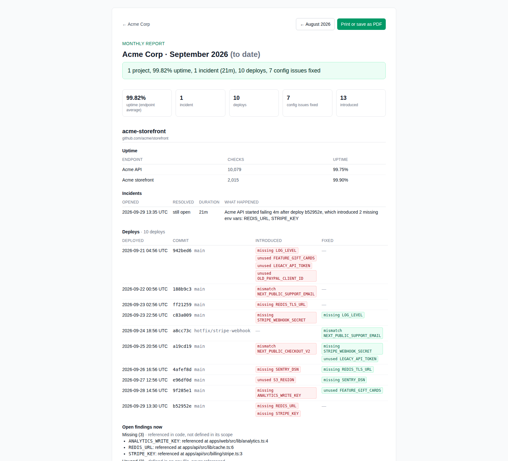

# deployhealth

**One page for every client project you maintain: is the config sane, is it up, and did the
last deploy break it.**

**[Try the live demo →](https://deployhealth.dev/demo)** · no sign-up, read-only sample data

The hosted version at deployhealth.dev is free while in beta.

If you look after a dozen client sites and APIs, most bad deploys fail the same boring way: a new
env var nobody set, a secret renamed in code but not in `.env.example`. deployhealth groups your
projects by client and watches both halves:

- **Config health.** A GitHub Action scans every push for env vars that are referenced but never
  defined, defined but never used, or out of sync between `.env` and `.env.example`.
- **Uptime.** A worker checks your health endpoints every 1, 5 or 15 minutes.

When an endpoint goes down shortly after a deploy, the alert names the deploy and the variables it
newly left undefined:

> Acme API started failing 4m after deploy b52952e, which introduced 2 missing env vars:
> REDIS_URL, STRIPE_KEY

And when a contract ends, or a month does, it writes the paperwork: a **handoff document** for the
client and a **monthly report** you can share with a link.



## What you get

### Config health on every push

Each project gets a GitHub Action. On every push it scans the repo and reports what's missing,
unused or out of sync, per env scope (so `apps/web` is checked against `apps/web/.env.example`),
with `file:line` for every finding and a history per deploy.



Setup is one token and one workflow file. The scanner is the MIT-licensed npm package
[`deployhealth-scan`](https://www.npmjs.com/package/deployhealth-scan), pinned to an exact version:



### Pull request checks

Install the deployhealth GitHub App on a repository and every pull request gets one comment,
updated on each push, headed **deployhealth · env check**:

- the env vars the pull request **adds, removes or renames**, with `file:line`;
- new ones **missing from `.env.example`** (in the scope that reads them);
- **committed `.env` files** (`.env`, `.env.local`, `.env.*.local`) and **secret-shaped strings**
  on added lines (AWS, GitHub and Slack tokens, private keys, deployhealth tokens), reported by
  location only, never by value.

A `deployhealth / env` check run goes with it. Each project picks a mode: **comment** (the check is
neutral when something is flagged), **strict** (it fails, so branch protection can block the
merge) or **off**. Pull requests from coding agents (Claude, Codex, Copilot, Cursor, Devin) are
marked, and each client page counts the month's agent pull requests that added undeclared env vars.



### Uptime, alerts, and the deploy that caused them

Endpoints get a status, "Down for 22m", 24-hour and 7-day uptime, a p50/p95 latency chart and
the last 20 checks. Alerts open after two failed checks in a row, link the deploy that preceded
them, and can post to Slack or Discord.



### Handoff export

When a contract ends, **Export handoff** produces the document you give the client: every
environment variable the code needs (names only, never values), grouped by the env file that must
define it and flagged when missing; the monitored endpoints; the GitHub Action; open findings;
30 days of uptime and alerts; and your "How to deploy" notes. It's a printable page (print it or
**save it as PDF** from the browser's print dialog) and a Markdown download, built from the same
data.



### Monthly client reports

Every client gets a monthly report covering all their projects: uptime per endpoint, each incident
(opened, resolved, how long, what happened), every deploy with the config issues it introduced or
fixed, and what's open now. A one-line summary at the top is computed from the numbers:
"3 projects, 99.94% uptime, 1 incident (21m), 14 deploys, 2 config issues fixed". **Share report**
creates a signed link your client can open without an account, valid for 90 days.



## Try the demo

The demo is a real deployhealth instance showing sample clients (Acme Corp, Northwind Bakery), read
only, no sign-up: **https://deployhealth.dev/demo**

Its alert is real: "Acme API" points at an endpoint that always answers 503, and the worker checks
it every minute. The data resets to its starting state every night.

To run it yourself, follow [Local setup](#local-setup) and open http://localhost:3000/demo.

## Self-hosting

deployhealth is free to self-host (see [Licensing](#licensing)). It needs Postgres 16 and two Node
22 processes, web and worker:

- **On your machine:** [`docker-compose.yml`](docker-compose.yml) runs Postgres, and
  [Local setup](#local-setup) starts web and the worker.
- **On Railway:** [docs/deploy-railway.md](docs/deploy-railway.md) walks through the three services,
  every build and deploy setting, every variable, and how to check the result.
- **Anywhere else** that runs Node and Postgres: the same guide lists each service's build,
  pre-deploy (migrations) and start commands, and all variables.

## Security

[**/security**](https://deployhealth.dev/security) explains what deployhealth
stores (variable names and `file:line`, never values; endpoint URLs; findings), how checks run
(SSRF-guarded, 10 s budget, response bodies never read or stored), how share links work, and how
to report a vulnerability, with our commitment to email affected users within 72 hours of
confirming an incident. The same contact is in
[`/.well-known/security.txt`](https://deployhealth.dev/.well-known/security.txt).

## Licensing

The CLI and scanner (packages/core) are MIT. The web app and worker are FSL-1.1-MIT: free to use and
self-host, not to offer as a competing hosted service; converts to MIT two years after each release.

- [`packages/core/LICENSE`](packages/core/LICENSE): MIT, for `packages/core`.
- [`LICENSE`](LICENSE): FSL-1.1-MIT (Functional Source License, MIT future license), for
  `apps/web`, `apps/worker`, `packages/db` and everything else in this repository.

## Phases

| Phase | Status | What it adds |
| --- | --- | --- |
| 1. Config health | Done | GitHub Action + CLI, ingest API, findings per deploy, project pages, GitHub login |
| 2. Clients, uptime and alerts | Done | Clients, uptime checks from a worker, alerts linked to deploys, Slack/Discord webhooks |
| 3. Demo, handoff and reports | Done | Public read-only demo, endpoint names, handoff export, monthly client reports with share links |
| 4. Security and pull requests | Done | CLI on npm, hard caps, /security, GitHub App env checks on every pull request |
| Next | Ideas | See [Known limitations](#known-limitations) for what's deliberately missing |

## Local setup

You need Node 22.12+, pnpm 10 (`corepack enable`) and Docker.

```sh
pnpm install
docker compose up -d                              # Postgres 16 on localhost:5432

cp apps/web/.env.example apps/web/.env.local      # set AUTH_SECRET: openssl rand -base64 32
cp apps/worker/.env.example apps/worker/.env
cp packages/db/.env.example packages/db/.env

pnpm db:migrate
pnpm db:seed                                      # the demo data (below); prints an ingest token
pnpm dev                                          # web on http://localhost:3000, plus the worker
```

- **http://localhost:3000/demo** shows the seeded demo, read-only (`DEMO_PUBLIC=1` in the example env).
- **http://localhost:3000** → **Continue as dev user** signs you in as a local account where you
  can create clients and projects. It exists only when `AUTH_DEMO_LOGIN=1` and the app isn't
  running in production. To sign in with GitHub instead, create a GitHub OAuth app with callback
  URL `http://localhost:3000/api/auth/callback/github` and set `AUTH_GITHUB_ID` and
  `AUTH_GITHUB_SECRET` in `apps/web/.env.local`.

The seed gives the demo user two clients (Acme Corp, Northwind Bakery) and three projects, one
without a client, with named endpoints and a week of checks. One incident is scripted:
acme-storefront's last deploy introduces two undefined variables, "Acme API" starts failing four
minutes later, and an open alert links the two. Acme API points at `<DEMO_BASE_URL>/api/demo/broken`
(always 503); the healthy endpoints point at `example.com` and `example.org`.

Tests: `pnpm test` (unit; needs the Postgres from docker compose) and `pnpm e2e` (Playwright
smoke tests). See [CLAUDE.md](CLAUDE.md) for details.

## Deploy to Railway

deployhealth runs as three Railway services: **Postgres**, **web** and **worker**. Build, deploy
and health-check settings are entered by hand in the Railway dashboard; `apps/web/railway.json`
and `apps/worker/railway.json` record the values as documentation only (Railway has deprecated
config-as-code). Both services build from the repo root (it's a pnpm workspace), and web applies
database migrations in its pre-deploy step. With `DEMO_PUBLIC=1`, the worker creates the demo data
itself. The dashboard steps, every field and variable, and troubleshooting are in
[docs/deploy-railway.md](docs/deploy-railway.md).

## How it works

### Config: the ingest flow

```
git push ─▶ GitHub Action ─▶ deployhealth-scan (in CI) ─▶ POST /api/ingest/scan ─▶ Postgres ─▶ dashboard
```

1. **Create a project** (optionally under a client). You get an ingest token (`dh_…`, shown once;
   only its SHA-256 is stored) and a workflow snippet. Save the token as the repo secret
   `DEPLOYHEALTH_TOKEN` and commit the snippet as `.github/workflows/deployhealth.yml`.
2. **On every push**, the Action runs the CLI from npm, pinned to an exact version
   (`npx --yes deployhealth-scan@0.1.0`: one 12 KB file, no dependencies), on the checkout with the
   commit sha and branch. The job's token is read-only (`permissions: contents: read`), and the
   workflow runs on pushes only, never on pull requests from forks, since it reads a secret.
3. **The scanner** walks the repo, respecting `.gitignore` and skipping `node_modules`, `dist`,
   `.git`, `.next` and virtualenvs. It finds references in JS/TS (`process.env.X`,
   `process.env["X"]`, `import.meta.env.X`), Python (`os.environ["X"]`, `os.environ.get("X")`,
   `os.getenv("X")`), Go (`os.Getenv("X")`, `os.LookupEnv("X")`) and Ruby (`ENV["X"]`,
   `ENV.fetch("X")`), and reads `.env`, `.env.example` and `.env.local`.
   - **Env scopes (monorepos).** Every directory with an env file is a scope, and each source file
     is checked against its nearest one. So `apps/web/src/x.ts` is compared with
     `apps/web/.env.example`, not with another package's.
   - Findings are **MISSING** (referenced, not defined in the scope), **UNUSED** (defined, never
     referenced) and **MISMATCH** (in `.env` but not `.env.example`, or the reverse), each with
     `file:line`.
4. **The CLI posts** `{ sha, branch, timestamp, findings[], variables[] }` with
   `Authorization: Bearer <token>`. `variables` lists every referenced name per scope with the env
   files that define it. **Env values never leave CI**: the contract only admits names.
5. **The server** checks the token (by hash) before reading the body, validates the payload with
   the schema the CLI was built against, then in one transaction:
   - creates the **deploy** for that sha, or reuses it when CI re-runs;
   - stores a **scan** with counts it computes itself;
   - stores every **finding** and **variable**.

Try the scanner locally: `npx deployhealth-scan@0.1.0 --dry-run` (add `--json`, `--ignore NAME_*`,
`--exclude path/`). This repository scans itself the same way on every push to `main`
([`.github/workflows/deployhealth.yml`](.github/workflows/deployhealth.yml)).

### Deprecated: downloading the CLI from your instance

Workflows created before the npm package download `/deployhealth-scan.mjs` from your deployhealth
instance with `curl` and run it with `node`. That file is still served, now with a `Deprecation`
header, and will be removed in a later release. To migrate, copy the new workflow from the
project's settings page, or replace the `curl …` and `node "$RUNNER_TEMP/deployhealth-scan.mjs"`
lines with `npx --yes deployhealth-scan@0.1.0` and the same flags, then add `permissions:
contents: read` to the job and `package-manager-cache: false` to `actions/setup-node`.

### Uptime: the worker

- **`check-endpoints`** runs every minute on pg-boss (singleton, so runs never overlap). It claims
  the enabled endpoints whose `next_check_at` has passed and gives each a start time, so that **no
  hostname is checked more than once every 10 seconds**, whoever's endpoints point at it. Claimed
  endpoints are checked in waves by start time, up to 10 at a time; one that didn't get a slot this
  minute goes first the next.
- **A check** is one request (GET or HEAD) with a 10 s budget that follows up to 5 redirects. It's
  ok when the final status equals the expected status (default 200). Timeouts, DNS failures, TLS
  errors, refused connections and wrong statuses are recorded as failures with a short reason.
  Response bodies are never read.
- **`prune-checks`** runs nightly (03:17 UTC): it rolls every complete UTC day up into daily
  totals, then deletes raw checks from whole days more than 30 days back. Reports read the daily
  totals, so months stay accurate after the raw checks are gone.
- **`reseed-demo`** (only with `DEMO_PUBLIC=1`) restores the public demo nightly and on start.

### Alerts and the correlation rule

After every check, the worker applies one rule in the same transaction that records the check:

- **Open** an alert when an endpoint has failed **2 checks in a row** and has **at least one ok
  check in its history**. A URL that has never worked doesn't alert. There's at most one open
  alert per endpoint (enforced by a unique index).
- **Resolve** it on the endpoint's next ok check.

Endpoints are named in alerts by their **name** ("Acme API") when you give one, otherwise by their
host. While an endpoint is failing, its card and its project's row on /clients say for how long
("Acme API down for 21m"), counted from the first failed check of the current run.

When an alert opens, deployhealth finds the project's **most recent deploy in the 30 minutes
before the first failed check**. It then compares that deploy's latest scan with the previous
deploy's latest scan, and the message lists only MISSING variables that are **new** in this
deploy:

- `Acme API started failing 4m after deploy b52952e, which introduced 2 missing env vars: REDIS_URL, STRIPE_KEY`
- `Acme API started failing 4m after deploy b52952e, which had no new config findings`
- `Acme API started failing; no deploy in the 30 minutes before the first failure`

If the project has an **alert webhook URL** (Slack incoming webhook, or Discord's with `/slack`
appended), deployhealth POSTs `{"text": "…"}` when the alert opens and again when it resolves. A
failed delivery is logged and retried at most once.

### Handoff export

`/projects/:id/handoff` (printable) and `/projects/:id/handoff.md` (download) render the same data:
the latest scan's variables grouped by scope, endpoints with 30-day uptime, the Action snippet, open
findings, 30 days of alerts and the project's deploy notes. There's no PDF library: the page has
print styles and no external assets, so the browser's **Save as PDF** is the PDF export. Deploy
notes are Markdown you write in project settings, rendered as untrusted content (no raw HTML, no
images). All times are UTC.

### Monthly reports and share links

`/clients/:slug/report?month=YYYY-MM` covers one UTC month. **Share report** signs a link with
HMAC-SHA256 over the client, the month and an expiry 90 days out (key: `REPORT_SHARE_SECRET`, or
one derived from `AUTH_SECRET`). The link opens that one report without an account; the public
route is rate-limited per IP. Links are stateless: nothing is stored, and the only way to revoke
them is to rotate the key, which revokes all of them.

### Pull requests: the GitHub App

```
PR opened / pushed ─▶ GitHub ─▶ POST /api/github/webhook ─▶ pr-check job ─▶ worker reads the PR ─▶ comment + check run
```

1. **The webhook** (`/api/github/webhook`) verifies `X-Hub-Signature-256` with a constant-time
   compare before reading anything, rate-limits each installation to 120 deliveries a minute, drops
   redeliveries by `X-GitHub-Delivery`, handles installation events itself and queues a `pr-check`
   job for new pull request heads. It answers 202 at once, calls no GitHub API and logs no bodies.
2. **Whose project.** An installation is linked to the deployhealth account whose GitHub id
   installed it (from the signed delivery, never from a URL). A pull request is checked only for
   that account's project with the same repository, so claiming someone else's repo name in a
   project gets you nothing.
3. **The worker** signs an App JWT, swaps it for an installation token (reused until it expires),
   and reads the pull request's head and merge base: both git trees, then only the files the
   scanner reads (same rules as the CLI, including `.gitignore`), each distinct blob once, plus the
   pull request's diff for secret patterns. At most 2,000 files and 20 MB; past that the check
   says so and stays neutral. All of it goes through the SSRF-guarded client, to api.github.com only.
4. **The report** is stored per head (`pr_checks`), the one comment is updated in place (found by a
   hidden `<!-- deployhealth-env-check -->` marker if needed), and the head gets its check run.
   Running a head again changes nothing new.

### SSRF protection

Endpoint and webhook URLs are user input, so they're checked twice:

- **On save:** only http/https, no credentials, and the host must not be (or resolve to) loopback,
  RFC1918, link-local, cloud metadata (`169.254.169.254`, `100.100.100.200`, `fd00:ec2::254`),
  CGNAT, multicast or reserved addresses.
- **At connect time:** a guarded DNS lookup repeats the check on the address the socket is about to
  use. That covers every redirect hop and DNS rebinding.

## Limits

Hard caps, the same on every plan: **100 endpoints per project and 500 per account**, **one check
per target hostname every 10 seconds** across all accounts, **5 MB** per scan report, and pull
request checks read at most **2,000 files and 20 MB** per pull request.

## Known limitations

- **Old workflows still download the CLI unpinned.** Workflows written before the npm package fetch
  `/deployhealth-scan.mjs` from your instance on every run, with no version or checksum, so
  whoever controls that instance controls what runs in their CI. New snippets pin an npm version;
  [migrate](#deprecated-downloading-the-cli-from-your-instance) the old ones.
- **MISMATCH needs a committed `.env`, or a platform integration.** CI checkouts rarely contain a
  `.env`, so MISMATCH only appears for repos that commit one (e.g. non-secret defaults). Comparing
  against the real variables on Vercel, Railway or Fly would need a platform integration; there
  isn't one yet.
- **Deploy time means scan time.** A deploy's time is when CI reported it, not when your platform
  finished rolling it out. If the rollout lags the push by more than 30 minutes, the alert won't
  link it.
- **One vantage point.** Checks come from wherever the worker runs (one Railway region). A network
  problem between that region and your endpoint looks like downtime; the 2-failure threshold
  softens this but doesn't remove it.
- **Minute resolution, UTC days.** Intervals are 1, 5 or 15 minutes, and a check can run up to a
  minute late. Raw checks are kept for 30 days; daily totals are kept for reports. Reports and
  handoffs use UTC months and days.
- **Share links can't be revoked one by one.** They're stateless; rotating `REPORT_SHARE_SECRET`
  revokes every link at once.
- **The share-link rate limit is per web instance**, in memory, and resets on restart.
- **Handoffs list the variables of the latest scan.** Scans from CLI versions before variable
  listing only show findings until the Action runs again.
- **Regex scanning.** References inside comments and strings count; aliased or destructured access
  (`const { X } = process.env`) is missed; only `.env`, `.env.example` and `.env.local` are read
  automatically.
- **Notifications** are webhook-only (no email or SMS), and each account is single-user (no team
  sharing).
- **Pull request checks follow the installer.** An App installed by an org admin checks pull
  requests only for that admin's deployhealth projects. Very large repositories (more than GitHub
  lists in one tree, or past the 2,000-file / 20 MB caps) aren't checked. Secret detection is a
  small set of fixed-prefix formats, not a full secret scanner.

## Repository layout

`apps/web` (Next.js), `apps/worker` (pg-boss), `packages/core` (scanner, CLI, SSRF guard, alert
rules, handoff and report rendering), `packages/db` (Drizzle schema, migrations, queries, seed).
See [CLAUDE.md](CLAUDE.md) for the full map and conventions.
